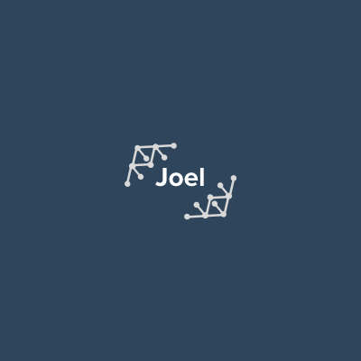

<h1 align="center"> ~/.dotfiles 📗 </h1>

  

</h1>

## Preview

  

## System Overview 
+ **OS**: Manjaro Linux
+ **Shell**: Bash
+ **WM**: i3-gaps
+ **Terminal**: Urxvt
+ **Editor**: Vim / NeoVim
+ **File Manager**: Ranger
+ **Launcher**: Rofi
+ **Browser**: Google Chrome
+ **Color Scheme Installer:** Pywal
+ **Wallpaper**: [r/wallpapers](https://www.reddit.com/r/wallpapers/) | [location](https://github.com/loej/dotfiles/blob/master/images/wallpaper.jpg)

## Setup 

+ **Screenfetch**: [pfetch](https://github.com/dylanaraps/pfetch)
+ **Font**: [Jetbrains Mono](https://www.jetbrains.com/lp/mono/)
+ **Startup Page**: I use [Jarvis](https://github.com/loej/Jarvis), a personalized startup page entirely inspired by [u/nytly](https://www.reddit.com/r/startpages/comments/f6hfoq/term_tree/?utm_source=share&utm_medium=web2x). 

## Using my dots

To copy certain parts of my dotfiles simply clone this repository and implemnt them to your set up. Certain parts of my .i3/config are specific to my own monitors using xrandr and rofi. You at your own risk.
